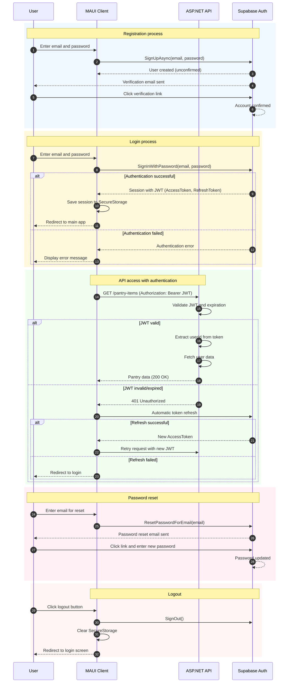

# Authentication Architecture - Sequence Diagram

<authentication_analysis>

## Authentication Requirements Analysis

Based on the PRD documentation and authentication specification, I identify the following authentication flows:

### 1. Main actors and their interactions:
- **User**: MAUI Client (mobile application)
- **MAUI Client**: Mobile application handling the user interface
- **ASP.NET API**: Backend minimal API
- **Supabase Auth**: Authentication service

### 2. Authentication flows:
- **Registration**: User creates account with email/password
- **Login**: User logs in with existing credentials
- **Password Reset**: User resets password via email
- **API Authorization**: API requests require valid JWT
- **Session Management**: Token storage and renewal

### 3. Token verification and refresh processes:
- JWT tokens are issued by Supabase Auth
- API validates JWT on every protected request
- Session is stored in MAUI SecureStorage
- Automatic token refresh by Supabase client

### 4. Authentication steps description:
1. **Registration**: Email/password → Supabase creates user → Verification email
2. **Login**: Email/password → Supabase verifies → Returns session with JWT
3. **API Access**: Client attaches JWT to Authorization header
4. **API Verification**: Checking JWT signature and expiration
5. **Session Expiration**: Automatic token refresh by client

</authentication_analysis>

<mermaid_diagram>

</mermaid_diagram>
