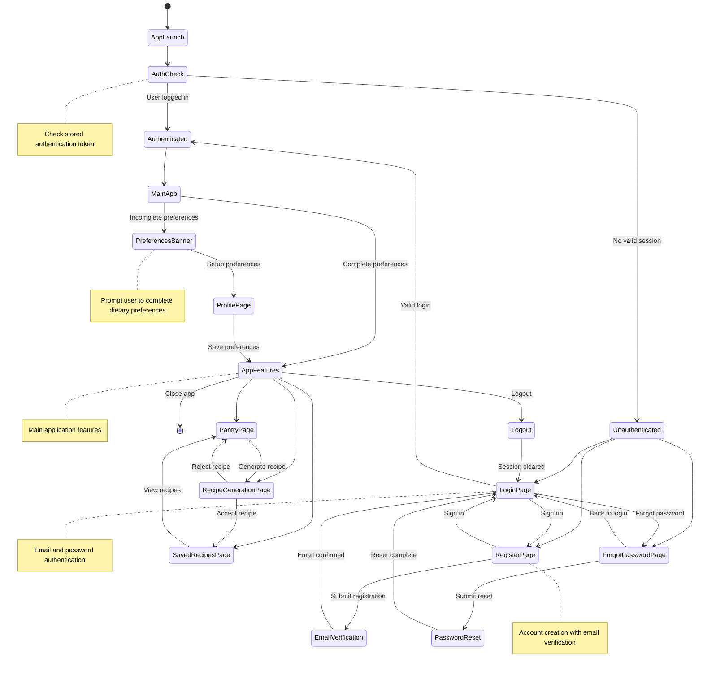

# User Journey - Authentication Flow

<user_journey_analysis>

## User Journey Analysis

Based on the PRD user stories and authentication specification, I identify the following user journeys:

### 1. User Paths and States:
- **First-time user journey**: App launch → Registration → Email verification → Login → Preferences setup → Main app
- **Returning user journey**: App launch → Login → Main app (with preferences prompt)
- **Password recovery journey**: Login page → Forgot password → Email reset → Back to login
- **Logout journey**: Main app → Logout → Login page

### 2. Main Journeys and Corresponding States:
- **Authentication Journey**: App launch → Auth check → Login/Register/Forgot Password → Main app
- **Registration Journey**: Register → Email verification → Login
- **Password Reset Journey**: Forgot password → Reset process → Login
- **Onboarding Journey**: Main app → Preferences setup → Full features
- **App Usage Journey**: Pantry → Recipe generation → Saved recipes

### 3. Decision Points and Alternative Paths:
- **Initial Auth Check**: Authenticated (skip login) vs Unauthenticated (show login options)
- **Authentication Choice**: Login, Register, or Forgot Password
- **Preferences Status**: Complete (full access) vs Incomplete (show banner)
- **Recipe Actions**: Accept (save), Reject (back to pantry), or Generate new

### 4. Purpose of Each State:
- **AppLaunch**: Application startup and initial routing
- **AuthCheck**: Verify existing authentication token
- **LoginPage**: User authentication with email/password
- **RegisterPage**: New account creation
- **EmailVerification**: Account activation via email
- **PreferencesBanner**: Dietary preferences setup prompt
- **AppFeatures**: Core application functionality
- **Logout**: Session termination

</user_journey_analysis>

<mermaid_diagram>

</mermaid_diagram>
