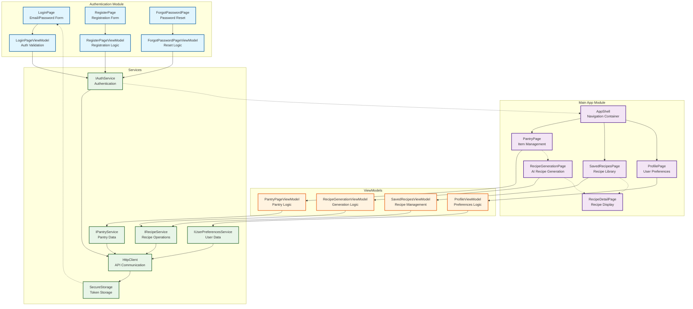

# UI Components Architecture - MAUI Application

<architecture_analysis>

## UI Components Analysis

Based on the PRD and authentication specification, I identify the following UI components for the PantryPal MAUI application:

### 1. Authentication Components:
- **LoginPage**: Email/password authentication form
- **RegisterPage**: New user registration with email verification
- **ForgotPasswordPage**: Password recovery via email
- **LoginPageViewModel**: Handles login validation and authentication
- **RegisterPageViewModel**: Manages registration process
- **ForgotPasswordPageViewModel**: Processes password reset requests

### 2. Main Application Components:
- **PantryPage**: Display and manage pantry items
- **RecipeGenerationPage**: AI recipe generation interface
- **SavedRecipesPage**: View saved recipes with pagination
- **RecipeDetailPage**: Display full recipe content
- **ProfilePage**: User preferences and settings
- **MainPage**: Shell container with tab navigation

### 3. Services and Data Flow:
- **IAuthService**: Authentication operations (login, register, logout)
- **IPantryService**: Pantry item CRUD operations
- **IRecipeService**: Recipe generation and management
- **IUserPreferencesService**: User profile data
- **HttpClient**: API communication with JWT authentication
- **SecureStorage**: JWT token persistence

### 4. Navigation and State Management:
- **AppShell**: Main navigation container with TabBar
- **Shell Navigation**: Modal pages for auth and recipe flows
- **Authentication Guards**: Redirect unauthenticated users to login
- **Session Management**: JWT storage and automatic token refresh

### 5. Component Functionality:
- **Views**: XAML UI definitions with data binding
- **ViewModels**: Business logic and state management
- **Services**: Data access and external API communication
- **Converters**: Data transformation for UI binding
- **Resources**: Styles, templates, and localization strings

</architecture_analysis>

<mermaid_diagram>

</mermaid_diagram>
